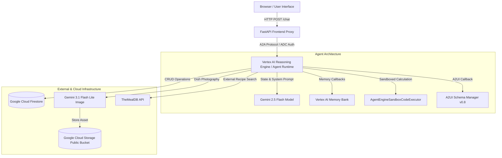

# Chef AI — Recipe Assistant & Culinary Companion


An executive-grade, AI-powered culinary companion built with the **Google Agent Development Kit (ADK)** and powered by **Gemini**. The **Chef AI Recipe Assistant** enables users to discover, search, scale, and save recipes in a personal cloud collection while dynamically maintaining user dietary preferences across sessions, executing secure Python sandboxed calculations, and rendering rich interactive A2UI card surfaces alongside AI-generated dish photography.

---

## 🏛️ System Architecture

The Recipe Assistant is engineered as a decoupled, microservices-oriented agent system leveraging the Agent-to-Agent (A2A) protocol and Google Cloud AI infrastructure.



---

## ⚡ Core AI & Platform Capabilities

| Capability | Integration Layer | Technical Implementation Details |
| :--- | :--- | :--- |
| **Reasoning & Planning** | Gemini 2.5 Flash | Root agent orchestration using ADK framework with multi-tool call capability. |
| **Declarative UI (A2UI)** | A2UI Schema v0.8 | `A2uiSchemaManager` & `a2ui_callback` render structured `Card`, `Column`, `Row`, `Text`, `Image`, and `Button` components natively. |
| **Memory Persistence** | Vertex AI Memory Bank | `PreloadMemoryTool` auto-extracts dietary requirements, favorite ingredients, and culinary style across user sessions. |
| **Sandboxed Code Execution** | Python Sandbox | `AgentEngineSandboxCodeExecutor` safely executes Python for scaling ingredient proportions and converting measurement units. |
| **Dish Image Generation** | Gemini 3.1 Flash Lite Image | Generates realistic dish photography on-demand, publishing artifacts directly to Google Cloud Storage. |
| **Cloud Recipe Storage** | Google Cloud Firestore | Structured recipe indexing supporting tag-based search (`favorite`, `gluten-free`, `quick`, `dinner`). |
| **Live External Discovery** | External API Tooling | `search_online_recipes` connects to live recipe databases for real-time culinary inspiration. |
| **Secure Inter-Agent Proxy** | A2A Protocol | Minimal FastAPI gateway authorizing frontend requests via Application Default Credentials (ADC). |

---

## 📊 Feature Implementation Matrix

| Feature Module | Status | Verification & Implementation |
| :--- | :---: | :--- |
| Firestore Recipe Database | ✅ Active | Real-time CRUD on `recipes` collection (seeded with favorite recipes) |
| Vertex AI Memory Bank | ✅ Active | Memory extraction callback enabled for long-term user context |
| Sandboxed Code Executor | ✅ Active | `AgentEngineSandboxCodeExecutor` configured on reasoning engine |
| A2UI Declarative Interface | ✅ Active | Basic Catalog v0.8 support in web UI mini-renderer |
| Imagen Dish Photography | ✅ Active | `gemini-3.1-flash-lite-image` integration + GCS public bucket hosting |
| External Recipe Search | ✅ Active | `search_online_recipes` API integration |
| Vector RAG Knowledge Base | ⏳ Planned | Enterprise document RAG expansion (planned architecture) |

---

## 📂 Repository Structure

```
recipe-assistant/
├── app/
│   ├── agent.py            # ADK root agent configuration, system prompt & callbacks
│   ├── tools.py            # Firestore, GCS, Imagen, and Search tool definitions
│   ├── a2ui_utils.py       # A2UI response formatting & component schema utilities
│   ├── fast_api_app.py     # Local agent execution endpoint
│   └── app_utils/          # A2A protocol & telemetry helper utilities
├── frontend/
│   ├── main.py             # FastAPI A2A proxy server & static route handler
│   ├── app.py              # Entrypoint wrapper module
│   ├── Dockerfile          # Container build specification for Cloud Run deployment
│   ├── requirements.txt    # Proxy dependencies
│   ├── static/             # Production web client static assets
│   └── templates/          # Chef AI Jinja template definitions
├── seed_recipes.py         # Automated Firestore database seeding script
├── agents-cli-manifest.yaml# Manifest specification for Agent Engine deployment
├── demo.gif                # Executive looping demonstration recording
└── README.md               # System documentation & architectural reference
```

---

## 💻 Local Setup & Execution Guide

### Prerequisites
- Python 3.11+
- Google Cloud SDK (`gcloud`) authenticated with Application Default Credentials:
  ```bash
  gcloud auth application-default login
  ```

### 1. Install Dependencies
```bash
uv sync
```

### 2. Seed Firestore Database
Populate your Google Cloud Firestore `recipes` collection with sample culinary data:
```bash
uv run python seed_recipes.py
```

### 3. Run Agent CLI / Developer Playground
Run single-shot agent queries locally:
```bash
uv run agents-cli run "What favorite recipes do I have saved?"
```

Launch the local ADK developer playground:
```bash
uv run agents-cli playground
```

### 4. Launch Production Web Frontend
Navigate to the `frontend/` directory, set environment variables, and launch the proxy:
```bash
cd frontend
pip install -r requirements.txt
export AGENT_ENGINE_RESOURCE_NAME="projects/<PROJECT_ID>/locations/us-east1/reasoningEngines/<ENGINE_ID>"
export AGENT_DIRECTORY="app"
python main.py
```
Open `http://localhost:8080` in your web browser to interact with the Chef AI studio interface.

---

## ☁️ Deployment Guide

### Deploy Agent Engine to Vertex AI
```bash
uv run agents-cli deploy
```

### Deploy Frontend Proxy to Cloud Run
```bash
gcloud run deploy recipe-assistant-frontend \
  --source ./frontend \
  --region us-east1 \
  --set-env-vars AGENT_ENGINE_RESOURCE_NAME="<REASONING_ENGINE_RESOURCE>",AGENT_DIRECTORY="app" \
  --allow-unauthenticated
```
