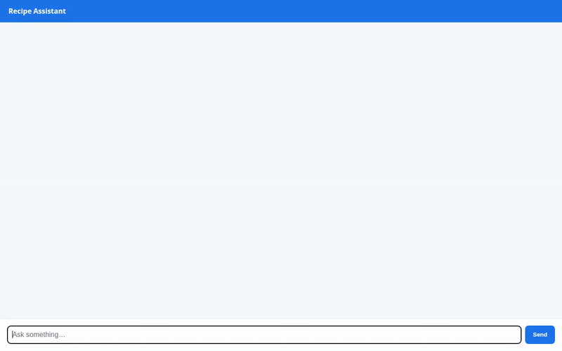

# Recipe Assistant Agent



An interactive, AI-powered culinary assistant built with Google Agent Development Kit (ADK) and Gemini. The **Recipe Assistant Agent** helps users discover, search, scale, and save recipes in a personal collection while remembering personal dietary preferences across sessions and generating dish images.

---

## 🌟 Features & Implemented Services

The project integrates the following Google Cloud services, tools, and UI framework capabilities:

- **Agent Engine / Agent Runtime Deployment**: Powered by `gemini-2.5-flash` running on Vertex AI Agent Engine.
- **Vertex AI Memory Bank**: Automatic extraction and preloading of user dietary preferences (e.g., gluten-free, Italian cuisine) across sessions via `PreloadMemoryTool` and post-turn memory callbacks.
- **Google Cloud Firestore Database**: Persistent recipe collection storage and querying via `save_recipe`, `search_recipes`, and `get_recipe_details` tools.
- **Google Cloud Storage (Public Bucket)**: Stores generated dish photos in a public bucket (`recipe-assistant-photos-1a15618a`) and serves public HTTPS image URLs.
- **AI Dish Image Generation**: Dish photography generation powered by `gemini-3.1-flash-lite-image` (in global region) via `generate_dish_photo`.
- **External Recipe Search API**: Real-time recipe lookup powered by public recipe search integration (`search_online_recipes`).
- **Agent Engine Sandbox Code Execution**: Secure Python code execution environment (`AgentEngineSandboxCodeExecutor` & `run_code`) for recipe scaling, unit conversions, and culinary calculations.
- **A2UI Declarative Interface**: Rendered with `A2uiSchemaManager` (v0.8 Basic Catalog) and `a2ui_callback` to format interactive cards and image components natively.
- **FastAPI Proxy & A2A Chat Frontend**: Minimal proxy server located in `./frontend` that authenticates via Application Default Credentials (ADC) and communicates with the agent using the Agent-to-Agent (A2A) protocol.

### 📋 Status of Planned Features

| Feature | Status | Notes |
| :--- | :--- | :--- |
| Firestore Recipe Storage | ✅ Implemented | Read/write Firestore database collection |
| Memory Bank Preferences | ✅ Implemented | Vertex AI Memory Bank session persistence |
| Image Generation | ✅ Implemented | `gemini-3.1-flash-lite-image` + GCS hosting |
| Code Execution Sandbox | ✅ Implemented | `AgentEngineSandboxCodeExecutor` |
| A2UI Card Surfaces | ✅ Implemented | Schema v0.8 Basic Catalog |
| External Recipe Search | ✅ Implemented | Public API tool |
| Vector RAG Knowledge Base | ⏳ Planned | Planned, not yet implemented |

---

## 🛠️ Project Structure

```
recipe-assistant/
├── app/
│   ├── agent.py          # Root agent definition, system instructions, & tool configuration
│   ├── tools.py          # Firestore, GCS, Image Gen, and Search function tools
│   ├── a2ui_utils.py     # A2UI response callback and formatting helper
│   └── fast_api_app.py   # FastAPI local agent entrypoint
├── frontend/
│   ├── main.py           # FastAPI proxy connecting browser to deployed agent over A2A
│   ├── Dockerfile        # Container build instructions for Cloud Run
│   ├── requirements.txt  # Frontend python dependencies
│   └── static/
│       └── index.html    # Chat UI HTML with built-in A2UI card renderer
├── agents-cli-manifest.yaml # Project metadata and deployment settings
├── demo.gif              # Looping demonstration recording
└── README.md             # Project documentation
```

---

## 🚀 Setup & Local Execution

### Prerequisites
- Python 3.11+
- `uv` or `pip`
- Google Cloud SDK (`gcloud`) with Application Default Credentials configured:
  ```bash
  gcloud auth application-default login
  ```

### 1. Install Dependencies
```bash
uv sync
```

### 2. Run Agent Locally
To test the agent locally using the ADK CLI:
```bash
agents-cli run "Suggest a healthy dinner recipe"
```

To launch the local ADK developer playground:
```bash
agents-cli playground
```

### 3. Run Web Frontend Proxy
Navigate to the `frontend` directory, set environment variables, and start the FastAPI proxy:
```bash
cd frontend
pip install -r requirements.txt
export AGENT_ENGINE_RESOURCE_NAME="projects/<PROJECT_ID>/locations/us-east1/reasoningEngines/<REASONING_ENGINE_ID>"
export AGENT_DIRECTORY="app"
python main.py
```
After starting `main.py`, open your browser to port 8080 on localhost to use the web chat UI.

---

## ☁️ Deployment

### Deploy Agent to Agent Runtime
```bash
agents-cli deploy
```

### Deploy Frontend Proxy to Cloud Run
```bash
gcloud run deploy recipe-assistant-frontend \
  --source ./frontend \
  --region us-east1 \
  --set-env-vars AGENT_ENGINE_RESOURCE_NAME="<REASONING_ENGINE_RESOURCE>",AGENT_DIRECTORY="app" \
  --allow-unauthenticated
```
